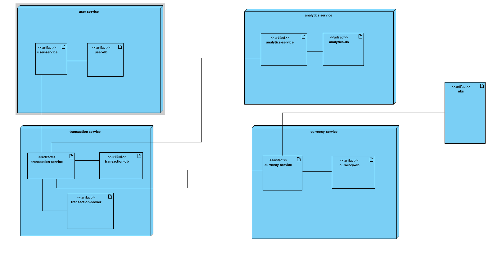

# Online banking service

How to run the project: 
1. Run `mvn clean install` in the root directory
NOTE: if this step fails you might not be running docker on your machine, it is neccessary for test containers
2. (OPTIONAL) Add `data.initialize: true` to application.yml of a service if you want to initialize some data in the tables, unfortunately this does nothing in transaction-service yet.
3. Run `docker compose up --build` in the root directory
NOTE: if this step fails you might have old volumes with false data, so please remove all volumes connected to this repository from docker and remove the online-banking-service container.
NOTE-2: if some service does not start because of the flyway migration error, please drop the flyway schema migration table from the db and restart the container.
Now all the services and the databases are running, and you can access them on the following ports:
- User-service: `localhost:8081/api/user-service`
- Transaction-service: `localhost:8082/api/transaction-service`
- Currency-service: `localhost:8083/currency-service`
- Analytics-service: `localhost:8080/api/analytics-service`

locust: we only defined the scenario of creating transactions in locust as it would be only API that the customers would
use frequently
there is defined a scenario when someone deposits money via ATM meaning in the scenario the customer deposits 1000 and
it is deducted
from the banks account

analytics data is not seeded so just run after locust so you launch etl that will create the data warehouse content,
normally it is run every day at 1 am to transform data from transaction service from previous day
POST http://localhost:8080/api/analytics-service/v1/etl/execute

## Use case:

## Dto Diagram

---

## User-service

Service for customer information, manages customer information. Creates customer accounts that are later linked to bank
accounts which can be used to transfer and store money.

## Analytics-service

Serves as a DWH for the system, contains aggregated facts about data from Transaction service used for creating reports
about accounts. For now only some reports are created, they include basic summaries as found in many banking
applications.
As of now only contains some mock data and functionality but in next milestone this service will contain an ETL process
that extracts data from transaction-service and stores it in the warehouse.

ETL is done asynchronously every day at 1 am using spring, using batch processing. It can be forced from the controller
of analytics as well.

## Transaction-service

Service handles all transaction related operations, it contains accounts, if a transaction is made this service creates
records about this on both accounts, from this the service can calculate customer balance and provide all operations,
it relies on Currency-service to provide services needed for international transactions.

Scheduled payments are done using spring scheduling.

Transaction processing is done using active-mq with JMS listeners. Upon calling transaction-api there is a transaction
initialized and enqueued into active-mq, later transaction-service reads from activemq and calls currency-service and
calculates transaction amount.

## Currency-service

Service handles all currency related operation, it manages currencies so exchange rates are always up-to-date and
provides needed services to the rest of the system.

### Swagger Links

- [Analytics-service](http://localhost:8080/api/analytics-service/swagger-ui/index.html)
- [User-service](http://localhost:8083/api/user-service/swagger-ui/index.html)
- [Transaction-service](http://localhost:8082/api/transaction-service/swagger-ui/index.html)
- [Currency-service](http://localhost:8081/api/currency-service/swagger-ui/index.html)

### Adminer

Password: `changemelater`

- [Analytics-service](http://localhost:8084/?pgsql=analytics-db&username=analytics_service&db=analytics_db&)
- [User-service](http://localhost:8084/?pgsql=user-db&username=user_service&db=user_db&)
- [Transaction-service](http://localhost:8084/?pgsql=transaction-db&username=transaction_service&db=transaction_db&)
- [Currency-service](http://localhost:8084/?pgsql=currency-db&username=currency_service&db=currency_db&)

### Grafana 
http://localhost:3000/

Username: `admin`
Password: `admin`

### Prometheus
http://localhost:9090/

### Entity relationship Diagram

### System architecture

