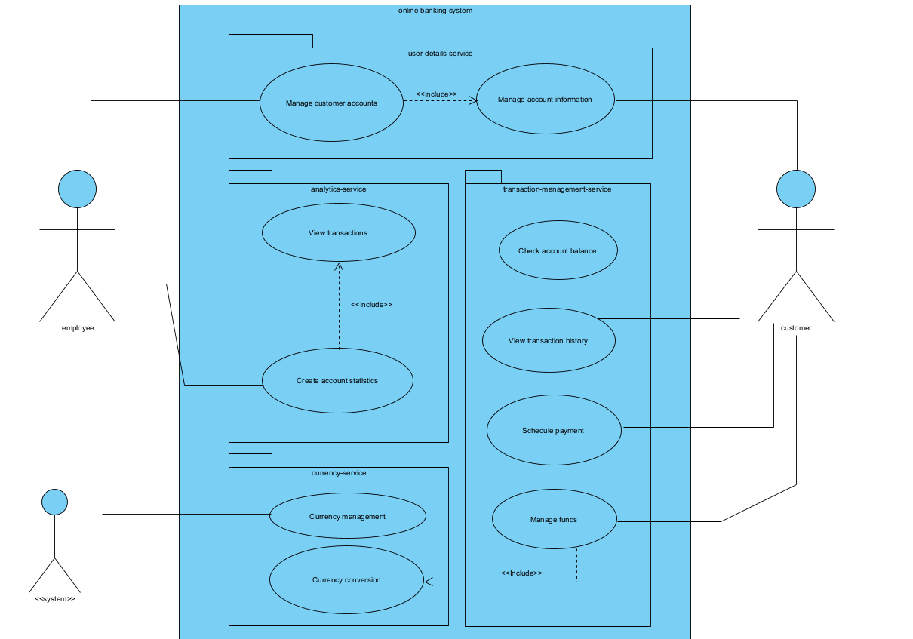
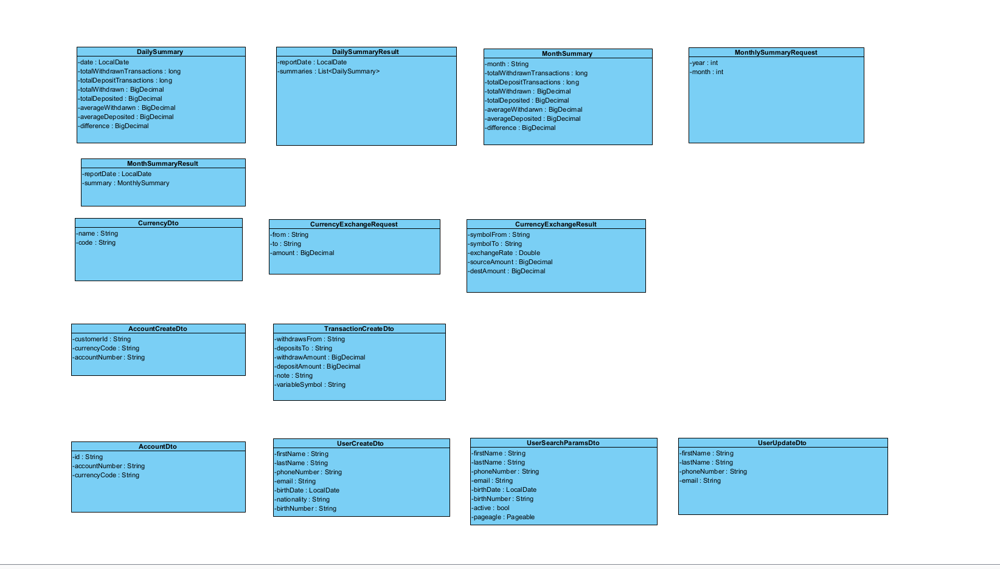
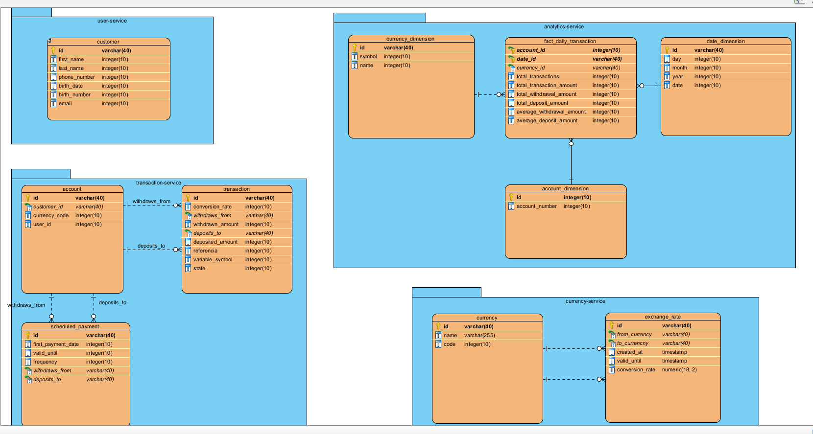

# Online banking service

How to run the project: 
1. Run `mvn clean install` in the root directory
2. Run `docker compose up` in the root directory
Now all the services and the databases are running, and you can access them on the following ports:
- User-service: `localhost:8081/api/user-service`
- Transaction-service: `localhost:8082/api/transaction-service`
- Currency-service: `localhost:8083/currency-service`
- Analytics-service: `localhost:8080/api/analytics-service`

## Use case:

## Dto Diagram

---

## User-service

Service for customer information, manages customer information. Creates customer accounts that are later linked to bank
accounts which can be used to transfer and store money.

## Analytics-service

Serves as a DWH for the system, contains aggregated facts about data from Transaction service used for creating reports
about accounts. For now only some reports are created, they include basic summaries as found in many banking
applications.
As of now only contains some mock data and functionality but in next milestone this service will contain an ETL process
that extracts data from transaction-service and stores it in the warehouse.

As of now there are only 2 dimensions: account and date. Currency and customer dimension will be added in M2 along with
implementation of ETL.

## Transaction-service

Service handles all transaction related operations, it contains accounts, if a transaction is made this service creates
records about this on both accounts, from this the service can calculate customer balance and provide all operations,
it relies on Currency-service to provide services needed for international transactions.

In M2 we need to implement creation and execution of scheduled payments.

## Currency-service

Service handles all currency related operation, it manages currencies so exchange rates are always up-to-date and
provides needed services to the rest of the system.

### Swagger Links

- [Analytics-service](http://localhost:8080/api/analytics-service/swagger-ui/index.html)
- [User-service](http://localhost:8083/api/user-service/swagger-ui/index.html)
- [Transaction-service](http://localhost:8082/api/transaction-service/swagger-ui/index.html)
- [Currency-service](http://localhost:8081/api/currency-service/swagger-ui/index.html)

### Adminer

Password: `changemelater`

- [Analytics-service](http://localhost:8084/?pgsql=analytics-db&username=analytics_service&db=analytics_db&)
- [User-service](http://localhost:8084/?pgsql=user-db&username=user_service&db=user_db&)
- [Transaction-service](http://localhost:8084/?pgsql=transaction-db&username=transaction_service&db=transaction_db&)
- [Currency-service](http://localhost:8084/?pgsql=currency-db&username=currency_service&db=currency_db&)

### Entity relationship Diagram

